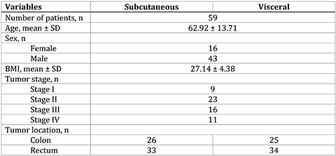
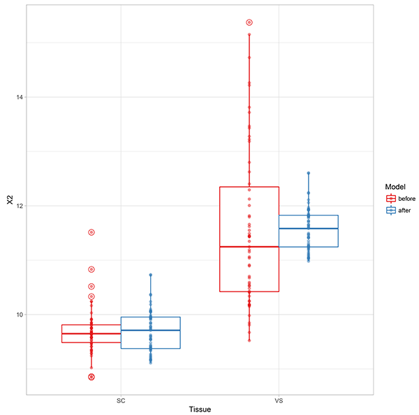
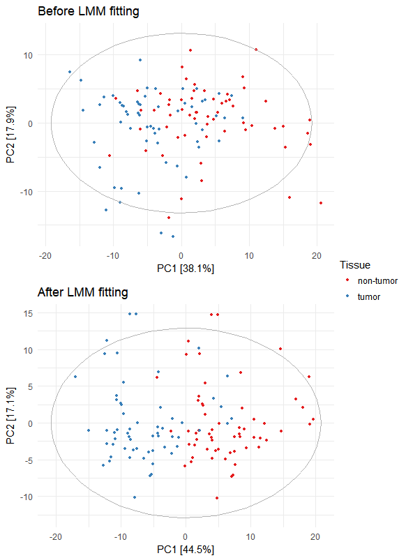
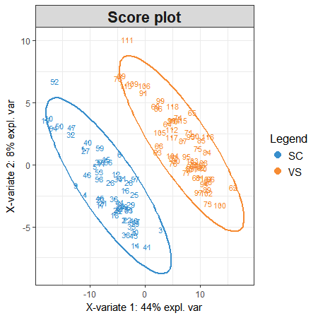
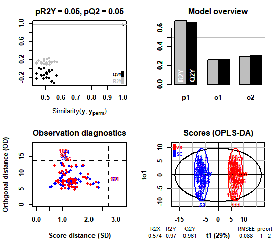

```{r setup, include = FALSE}
knitr::opts_chunk$set(
  collapse = TRUE,
  comment = "#>"
)
```

## Contents

**1 INSTALLATION**

**2 TUTORIAL**

2.1 Input format
   
2.2 Processing clinical metabolomics data with lmm2met 

2.3 Multivariate analysis

## 1 INSTALLATION

1.	Require R software 3.3.1 or higher (https://www.r-project.org/)
2.	Install lmm2met using the following commands in R terminal:

```
## Install devtools package, if not exist
install.packages("devtools")

## Install lmm2met package
devtools::install_github("kwanjeeraw/lmm2met")
```

## 2 TUTORIAL

Lipid profiles of adipose tissue samples [1] are used in this tutorial. The data set contains subcutaneous (SC) and paired visceral (VS) tissues from 59 patients. Patient metadata is in Table 1. Lipid profiling is performed using liquid chromatography qTOF MS (UPLC-QTOF MS), resulting in 158 lipids.



  *2.1 Input format*
  
  lmm2met accepts a dataframe of patient metadata and metabolite profiles as shown in Table 2.

```{r,echo=FALSE, results='asis', message=FALSE, warning=FALSE}
library(knitr)
library(kableExtra)
library(lmm2met)
dt = adipose[1:10,1:14]
kable(dt) %>%
  kable_styling(c("striped", "bordered"), full_width = F) %>%
  column_spec(1:9, bold = T, background = '#FFCCCC') %>%
  column_spec(9, border_right = T) %>%
  column_spec(10:14, background = '#CCE5FF')
```

**Table 2**. Part of adipose tissue data set is illustrated including patient metadata (red) and metabolite profiles (blue).

  *2.2 Processing clinical metabolomics data with lmm2met*
  
  Patient characteristics including age, BMI, sex, tumor location, and tumor stage formulate the fixed-effects part of the LMM. Patient identifier (Id) is included as a random intercept term of the LMM.
  
  Use the following commands in R terminal to process the data set:
  
```
## Load lmm2met package
library(lmm2met)

## Examine structure of adipose data
str(adipose)

## LMM fitting
fitMet = fitLmm(fix=c('Sex','Age','BMI','Stage','Location','Tissue'), random='(1|Id)', data=adipose, start=10)

## Observe LMM of the first metabolite
summary(fitMet$completeMod[[1]])

## Observe processed data
fitMet$fittedDat[1:10,1:14]

## Heatmaps of coefficients and significance levels of fixed effects
plot(fitMet, type='fixeff')

## Render coefficient table
plot(fitMet, type='coeff')

## Plot metabolites before and after LMM fitting (Figure 1)
plot(fitMet, type='fitted', fix='Tissue')
```



  *2.3 Multivariate analysis*

  Use the following commands in R terminal to perform PCA:
  
```
library(scales)
library(ggplot2)
mycolors = RColorBrewer::brewer.pal(name="Set1", n = 9)

## PCA before LMM fitting
pca = prcomp(adipose[,-1:-9], center = TRUE, scale. = TRUE)
prop.pca = summary(pca)
pcadata = cbind(adipose[,1:9], pca = pca$x)
ggplot(pcadata, aes(pca.PC1, pca.PC2)) +
  geom_point(aes(colour = Tissue), size = 1) +
  scale_color_manual(labels=c("non-tumor","tumor"), values = mycolors) +
  stat_ellipse(type = "norm", color='grey70', size=0.3) +
  theme_minimal() +
  labs(title = 'Before LMM fitting', x = paste("PC1 [", percent(prop.pca$importance[2,1]), "]", sep=""), y = paste("PC2 [", percent(prop.pca$importance[2,2]), "]", sep=""))

## PCA after LMM fitting
pca = prcomp(fitMet$fittedDat[,-1:-9], center = TRUE, scale. = TRUE)
prop.pca = summary(pca)
pcadata = cbind(fitMet$fittedDat[,1:9], pca = pca$x)
ggplot(pcadata, aes(pca.PC1, pca.PC2)) +
  geom_point(aes(colour = Tissue), size = 1) +
  scale_color_manual(labels=c("non-tumor","tumor"), values = mycolors) +
  stat_ellipse(type = "norm", color='grey70', size=0.3) +
  theme_minimal() +
  labs(title = 'After LMM fitting', x = paste("PC1 [", percent(prop.pca$importance[2,1]), "]", sep=""), y = paste("PC2 [", percent(prop.pca$importance[2,2]), "]", sep=""))
```



  Use the following commands in R terminal to perform PLS-DA:
  
```
## Perform PLS-DA using mixOmics package
dat = as.matrix(fitMet$fittedDat[,-1:-9])
vac.plsda <- mixOmics::plsda(dat, Y=fitMet$fittedDat$Tissue, ncomp=3)

## Score plot (Figure 3)
mixOmics::plotIndiv(vac.plsda)

## Feature selections based on VIP
vp = mixOmics::vip(vac.plsda)
df = data.frame(vp,row.names = dimnames(vp)[[1]])

## Discriminants on the 1st component with VIP > 1
ft = row.names(df)[which(df$comp.1 > 1)] 
```



Use the following commands in R terminal to perform OPLS-DA:
  
```
## Perform OPLS-DA using ropls package
dat = as.matrix(fitMet$fittedDat[,-1:-9])
ropls.oplsda <- ropls::opls(dat, y=fitMet$fittedDat$Tissue, plotL=F, predI = 1, orthoI = NA)

## Feature selections based on VIP
vp = ropls::getVipVn(ropls.oplsda)

## Discriminants on the 1st component with VIP > 1
ft = names(vp[vp > 1])
```



## REFERENCES

1. Liesenfeld, D.B., et al., Metabolomics and transcriptomics identify pathway differences between visceral and subcutaneous adipose tissue in colorectal cancer patients: the ColoCare study. Am J Clin Nutr, 2015. 102(2): p. 433-43.

2. Rohart, F., et al., mixOmics: An R package for 'omics feature selection and multiple data integration. PLoS Comput Biol, 2017. 13(11): p. e1005752.

3. Thevenot, E.A., et al., Analysis of the Human Adult Urinary Metabolome Variations with Age, Body Mass Index, and Gender by Implementing a Comprehensive Workflow for Univariate and OPLS Statistical Analyses. J Proteome Res, 2015. 14(8): p. 3322-35.
